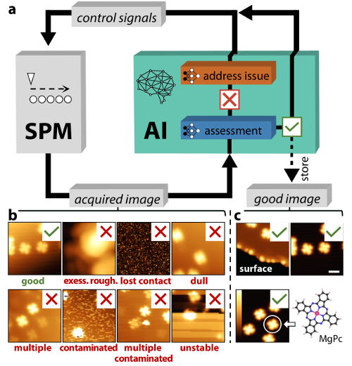

# Artificial-intelligence-driven scanning probe microscopy
Alexander Krull<sup>1,2</sup>, Peter Hirsch<sup>1</sup>, Carsten Rother, Agustin Schiffrin<sup>3,5</sup>, Cornelius Krull<sup>4,5</sup></br>
<sup>1</sup>Authors contributed equally, in no particular order</br>
<sup>2</sup>krull@mpi-cbg.de; <sup>3</sup>agustin.schiffrin@monash.edu; <sup>4</sup>ckrull@mailbox.org</br>
<sup>5</sup>These authors jointly supervised this work



Scanning probe microscopy (SPM) has revolutionized the fields of materials, nano-science, chemistry, and biology, by enabling mapping of surface properties and surface manipulation with atomic precision. However, these achievements require constant human supervision; fully automated SPM has not been accomplished yet.
Here we demonstrate an artificial intelligence framework based on machine learning for autonomous SPM operation (DeepSPM). DeepSPM includes an algorithmic search of good sample regions, a convolutional neural network to assess the quality of acquired images, and a deep reinforcement learning agent to reliably condition the state of the probe. DeepSPM is able to acquire and classify data continuously in multi-day scanning tunneling microscopy experiments, managing the probe quality in response to varying experimental conditions. Our approach paves the way for advanced methods hardly feasible by human operation (e.g., large dataset acquisition and SPM-based nanolithography). DeepSPM can be generalized to most SPM techniques, with the source code publicly available.

Paper: https://www.nature.com/commsphys/

# DeepSPM (code)

The code will be available here in the coming days!


## Cite
```
@Article{Krull2020,
author={Krull, Alexander
and Hirsch, Peter
and Rother, Carsten
and Schiffrin, Agustin
and Krull, Cornelius},
title={Artificial-intelligence-driven scanning probe microscopy},
journal={Communications Physics},
year={2020},
volume={TODO},
number={TODO},
pages={TODO},
abstract={Scanning probe microscopy (SPM) has revolutionized the fields of materials, nano-science, chemistry, and biology, by enabling mapping of surface properties and surface manipulation with atomic precision. However, these achievements require constant human supervision; fully automated SPM has not been accomplished yet. Here we demonstrate an artificial intelligence framework based on machine learning for autonomous SPM operation (DeepSPM). DeepSPM includes an algorithmic search of good sample regions, a convolutional neural network to assess the quality of acquired images, and a deep reinforcement learning agent to reliably condition the state of the probe. DeepSPM is able to acquire and classify data continuously in multi-day scanning tunneling microscopy experiments, managing the probe quality in response to varying experimental conditions. Our approach paves the way for advanced methods hardly feasible by human operation (e.g., large dataset acquisition and SPM-based nanolithography). DeepSPM can be generalized to most SPM techniques, with the source code publicly available.},
issn={TODO-TODO},
doi={TODO},
url={TODO}
}
```
